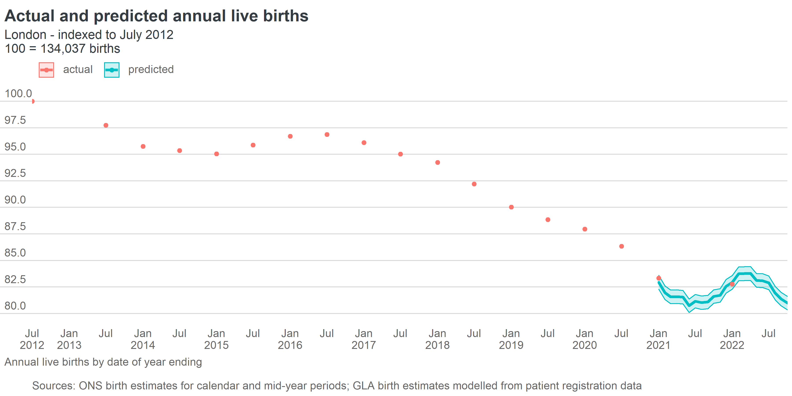
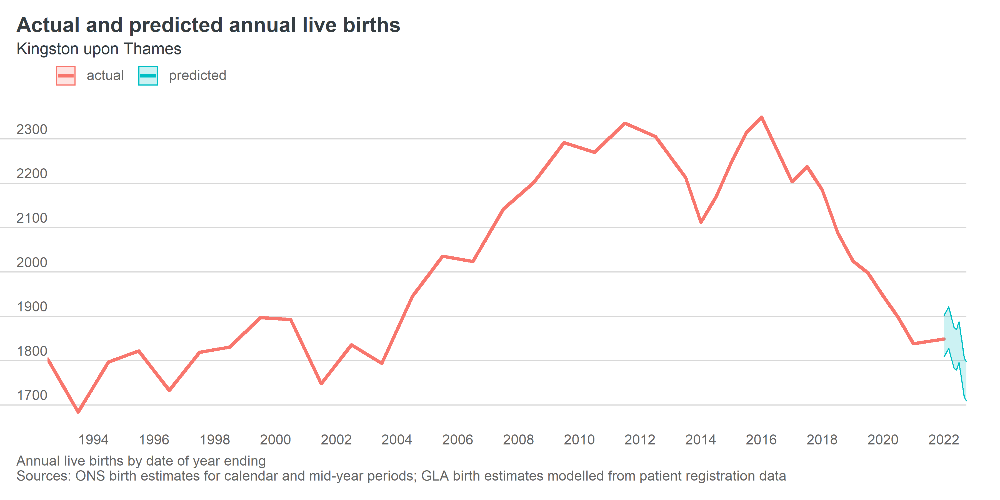
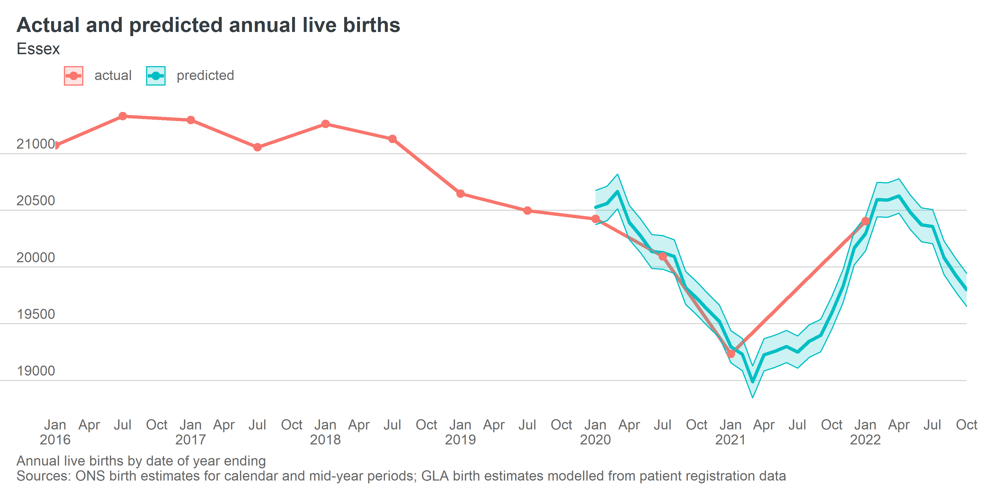

<!-- README.md is generated from README.Rmd. Please edit that file -->

```{r, include = FALSE}
knitr::opts_chunk$set(
  collapse = TRUE,
  comment = "#>",
  fig.path = "man/figures/README-",
  out.width = "100%"
)
```

# nowcast birth estimates

<!-- badges: start -->
<!-- badges: end -->
```{r, include=FALSE}
library(dplyr)
library(ggplot2)
library(tidyr)
library(gglaplot)

fpath <- list(births_actual = "data/processed/births_actual.rds",
              gp_0 = "data/processed/gp_age_0.rds")

births_actual <- readRDS(fpath$births_actual)

gp_0 <- readRDS(fpath$gp_0) %>%
  filter(date %in% unique(births_actual$date))

births_gp0 <- bind_rows(births_actual, gp_0) 

ratios_birth_gp0 <- births_gp0 %>%
  filter(date >= min(gp_0$date)) %>%
  group_by(across(-any_of(c("value", "measure")))) %>%
  summarise(value = sum(value[measure == "annual_births"])/sum(value[measure == "gp_count_age_0"]),
            .groups = "drop")

```

This repository contains code for producing monthly modelled estimates of annual births for local authorities and higher level geographies in England.

Outputs from this process are published on the London Datastore [here](https://data.london.gov.uk/dataset/modelled-estimates-of-recent-births)

Official birth estimates from ONS are considered very accurate, but the lag between the end of the period covered and the publication of estimates is typically 9-12 months. To gain a more timely indication of birth trends, the GLA Demography team produces modelled estimates of annual births based on counts of infants registered with GP practices. Modelled birth estimates can be produced with the same frequency and latency that [NHS Digital](https://digital.nhs.uk/data-and-information/publications/statistical/patients-registered-at-a-gp-practice) publishes patient count data - currently this is monthly and with a lag of 1-2 weeks from the extract date.

# Overview of methodology

The approach used to generate the modelled birth estimates was originally described in this [2016 technical note](https://data.london.gov.uk/dataset/estimating-births-using-gp-registration-data). The methodology relies on the fact that the count of persons age 0 (i.e. yet to reach their first birthday) resident in an area are correlated with the number of births that have taken place in that area over the preceding year. 

```{r, echo=FALSE, fig.height=4, fig.width=8}
sel_cds <- c("E92000001", "E12000007", "E09000028", "TLH3")

births_gp0 %>%
  filter(gss_code %in% sel_cds) %>%
  filter(date >= as.Date("2012-07-01")) %>%
  ggplot(aes(x = date, y = value/1000, colour = measure)) +
  theme_gla(free_y_facets = TRUE, gla_theme = "inverse") +
  ggla_line() +
  labs(title = "Annual births and persons age 0 on patient register",
       subtitle = "thousands") +
  theme(legend.position = "bottom") +
  facet_wrap("gss_name", ncol = 2, scales = "free_y")
```

The average ratio of live births to counts of persons age 0 on the patient register over a user defined period is calculated for each area. These ratios are then applied to patient register counts to create modelled birth estimates. 

```{r, echo=FALSE,  fig.height=3, fig.width=8}
sel_cds <- c("E92000001", "E12000007", "E09000028", "TLH3")
dt_start <- as.Date("2018-07-01")
dt_end <- as.Date("2022-01-01")
dt_label <- as.Date("2020-04-01")

ratios_birth_gp0 %>%
  filter(gss_code %in% sel_cds) %>%
  ggplot(aes(x = date, y = value, colour = gss_name)) +
  theme_gla(gla_theme = "inverse") +
  geom_vline(xintercept = dt_start, linetype = "dashed", colour = "grey", size = 1.02) +
  geom_vline(xintercept = dt_end, linetype = "dashed", colour = "grey", size = 1.02) +
  annotate("text", x = dt_label, y = 1.17, label = "Period selected to define ratios",
           colour = "grey") +
  ggla_line() +
  ylim(1.05, 1.175) +
  labs(title = "Ratio of births to persons age 0 on patient register") 

```

Confidence intervals for the predicted births are calculated based on the observed level of variation in the ratio of births to patient counts. The presented intervals reflect a range of two standard deviations in the ratio either side of the mean value.

Ratios for regions and subregions will tend to be exhibit less noise than those for individual local authorities and so estimated confidence intervals will tend to be proportionately smaller.  Ratios for individual areas may shift over time due for reasons including:

* Changing volumes of infant net migration relative to the number of births

* A change in the average period between a child being born and being added to the patient register

* A change in the proportion of infants not included on the patient register at all (e.g. those that engage exclusively wit private healthcare services)

* A change in the average time taken for changes in address to be reflected in the patient register

**Note: the COVID-19 pandemic may have significantly impacted one or more of these factors in many areas - apply appropriate caution in interpreting modelled estimates that may have been affected** 

# Data inputs

The birth and patient count inputs to the process are derived entirely from publicly available data:

1. Patient counts by age and local authority of residence are based on [data published by NHS Digital](https://digital.nhs.uk/data-and-information/publications/statistical/patients-registered-at-a-gp-practice) and modelled into the form used here in a [separate process](https://github.com/Greater-London-Authority/process-published-nhs-data)

2. Annual births by local authority are based on official ONS estimates collated from several different publications by [this process](https://github.com/Greater-London-Authority/collate-birth-data)

## Setup and usage

The files *births_lad.rds* - output by the [collate-birth-data](https://github.com/Greater-London-Authority/collate-birth-data) process -  and *gp_sya_lad.rds* - an output of [process-published-nhs-data](https://github.com/Greater-London-Authority/process-published-nhs-data) - must be placed in
```
data/raw/
```
Suitably formatted [birth](https://data.london.gov.uk/dataset/annual-birth-series) and [patient count data](https://data.london.gov.uk/dataset/patients-registered-at-a-gp-practice) inputs are published on the London Datastore, though these may not reflect the very latest data. 

These inputs are processed into the form required by the scripts 
```
R/1_process_lad_actual_births.R
and
R/2_process_lad_gp_data.R
```

Modelled birth estimates are produced by the script
```
R/3_produce_birth_estimates.R
```
Users can adjust the period on which the relationships between births and patient counts are based by changing the values assigned to *date_start* and *date_end*.

Various files containing actual and predicted births for local authorities, ITL2 subregions, Regions, and countries, as well as the underlying GP count data are output by the process and saved in
```
outputs/
```
The file *model_coefficients.csv* contains information for each area about the mean birth to patient count ratio, the standard deviation of the ratio, the correlation between births and patient counts and the period of past data for which these values were calculated. 

```{r, echo=FALSE}
knitr::kable(head(read.csv("outputs/model_coefficients.csv")))
```

Plots of the results for each area can optionally be generated by *4_produce_birth_plots.R* and these are saved in
```
outputs/plots/
```

### Example plots








## To do

* Add functionality to facilitate empirical quantification of the accuracy of modelled estimates and to identify the optimal period of past data on which to base the relationships between births and patient counts

* Extend the model to produce modelled estimates of monthly births (rather than monthly-updated estimates of annual births).  

* Add versions of plotting functions that don't rely on having gglaplot installed
