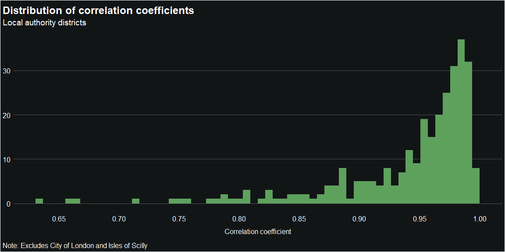
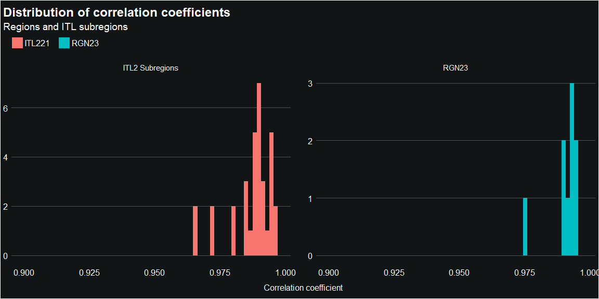

<!-- README.md is generated from README.Rmd. Please edit that file -->

# nowcast birth estimates

<!-- badges: start -->
<!-- badges: end -->

This repository contains code for producing monthly modelled estimates
of annual births for local authorities and higher level geographies in
England.

Outputs from this process are published on the London Datastore
[here](https://data.london.gov.uk/dataset/modelled-estimates-of-recent-births)

Official birth estimates from ONS are considered very accurate, but the
lag between the end of the period covered and the publication of
estimates is typically 9-12 months. To gain a more timely indication of
birth trends, the GLA Demography team produces modelled estimates of
annual births based on counts of infants registered with GP practices.
Modelled birth estimates can be produced with the same frequency and
latency that [NHS
Digital](https://digital.nhs.uk/data-and-information/publications/statistical/patients-registered-at-a-gp-practice)
publishes patient count data - currently monthly and with a lag of 1-2
weeks from the extract date.

# Data inputs

The birth and patient count inputs to the process are derived entirely
from publicly available data:

1.  Patient counts by age and local authority of residence are based on
    [data published by NHS
    Digital](https://digital.nhs.uk/data-and-information/publications/statistical/patients-registered-at-a-gp-practice)
    and modelled into the form used here by the
    [process-published-nhs-data](https://github.com/Greater-London-Authority/process-published-nhs-data)
    process.

2.  Annual births by local authority are based on official ONS estimates
    collated from several different publications by the
    [collate-birth-data](https://github.com/Greater-London-Authority/collate-birth-data)
    process.

# Setup and usage

The files *births_lad.rds* - output by the
[collate-birth-data](https://github.com/Greater-London-Authority/collate-birth-data)
process - and *gp_sya_lad.rds* - an output of
[process-published-nhs-data](https://github.com/Greater-London-Authority/process-published-nhs-data) -
must be placed in

    data/raw/

[Birth](https://data.london.gov.uk/dataset/birth-estimates) and [patient
count
data](https://data.london.gov.uk/dataset/patients-registered-at-a-gp-practice)
inputs are published on the London Datastore, though these may not
reflect the latest available data.

These inputs are processed into a suitable format by:

    R/1_process_lad_actual_births.R

and

    R/2_process_lad_gp_data.R

These scripts only need to be run when updating birth or patient count
data.

Once the input data has been processed, modelled births are produced by:

    R/3_produce_birth_estimates.R

Various files containing actual and predicted births for local
authorities, ITL2 subregions, Regions, and countries, as well as the
underlying GP count data are output by the process and saved in

    outputs/

Plots of the results for each area can optionally be generated by
*4_produce_birth_plots.R* and these are saved in

    outputs/plots/

# Overview of methodology

The approach used to generate the modelled birth estimates was
originally described in this [2016 technical
note](https://data.london.gov.uk/dataset/estimating-births-using-gp-registration-data).
The methodology relies on the strong correlation between the patient
register counts of persons age 0 (i.e. yet to reach their first
birthday) resident in an area with the number of births that have taken
place in that area over the preceding year.

The correlation between births and patient counts tends to be greater at
larger geographic areas, such as regions and subregions, than it is for
individual local authorities.

Ratios of births to patient register counts vary over time. The reasons
for changes in a given area might include:

- Changing volumes of infant net migration relative to the number of
  births
- A change in the average period between a child being born and being
  added to the patient register
- A change in the proportion of infants not included on the patient
  register at all (e.g. those that engage exclusively wit private
  healthcare services)
- A change in the average time taken for changes in address to be
  reflected in the patient register

Recent ratios are forecast from the time series of available past data.
In the current implementation a simple exponential smoothing method from
the *Fable* package is used to do this. For each area, the model returns
the mean forecast value of the ratio as well as the 95 percent
prediction interval.

Past ratios are calculated using annual births for mid and calendar year
periods and the forecast ratios produced by the time series model have
the same frequency.

Both forecast and past ratios are interpolated to match the monthly
frequency of the patient register data. This allows:

- predicted recent births to be updated monthly as each new set of
  patient count data is released
- creation of annual birth estimates for the months between standard
  mid-year and calendar year releases (these estimates are labelled as
  ‘interpolated’ in the output files)

Predicted recent births for each area are calculated as the product of
recent patient register counts and forecast ratios.

# Potential improvements

##### Incorporate monthly annual birth estimates

Currently only actual births for mid and calendar year periods are used
to calculate past ratios. Monthly annual birth estimates for recent
years could be constructed directly from official monthly birth
estimates that ONS publish as semi-regular ad-hoc releases. This is
currently listed as a TODO in [collate birth
data](https://github.com/Greater-London-Authority/collate-birth-data).

Including monthly actual data would:

- greatly increase the number of data points available as a basis for
  forecasting ratios and cross validation
- remove the need to interpolate monthly ratios from the 6 monthly data
- increase potential to account for seasonality in the ratios
- extend the approach to create estimates of recent births by month
  (rather than annual births by month of year ending)

# Assessing accuracy of birth predictions

A given set of birth predictions can be compared with subsequent actuals
once they become available.

To assess the overall accuracy of the predictions, we can produce and
analyse multiple sets of predictions based on the data available at
different points in the past. To provide context, accompanying sets of
‘naive’ predictions are produced using the simple method of predicting
future annual births in an area will be the same as the last actual
estimate.

This approach provides an indication of how the accuracy of predictions
might be expected to vary, e.g.: over time, by distance from last actual
data, by geographical area. In addition, this approach allows an
empirical assessment of the reliability of the stated prediction
intervals estimated by the model.

## Accuracy by geography and forecast horizon

The mean accuracy of modelled births is strongly dependent on geography,
with predictions for local authority districts being far less accurate
than those for higher level geographies. For districts, accuracy appears
to decrease gradually with forecast horizon, though the relationship is
unclear for larger geographies.

Births modelled using patient count data proved to be far more accurate
than naive prediction. In contrast to the modelled data, the accuracy of
the naive predictions showed much less variation by geography, but
rapidly declined as the forecast horizon increased.

## Accuracy over time

The mean accuracy of the modelled births for a given forecast horizon
and geography have remained relatively consistent (within ~0.5% MAPE)
over successive sets of predictions. Accuracy of the naive predictions
varied by a much greater degree over time.

## Reliability of stated prediction intervals

The modelled births are currently produced with a stated 95% prediction
interval. This interval is determined by the estimated prediction
interval for the forecast ratios produced by the time series model (as
predicted births are proportional to the forecast ratios).

To test the reliability of the estimated intervals we count the
proportion of subsequent actual births that sat within the stated
interval across all sets of predictions.

This shows that the stated ranges underestimate the true 95% prediction
intervals for all geographies.

